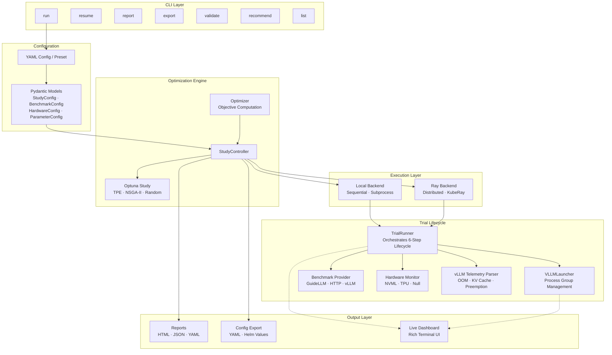
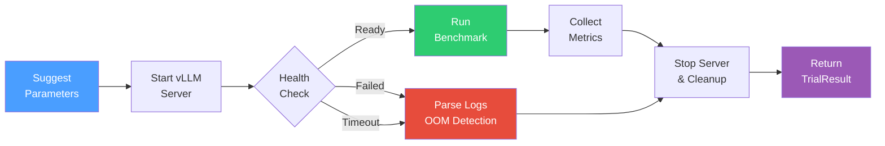
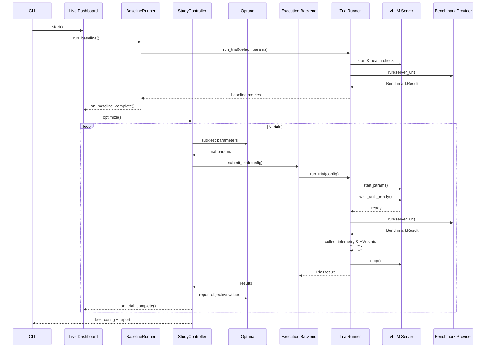
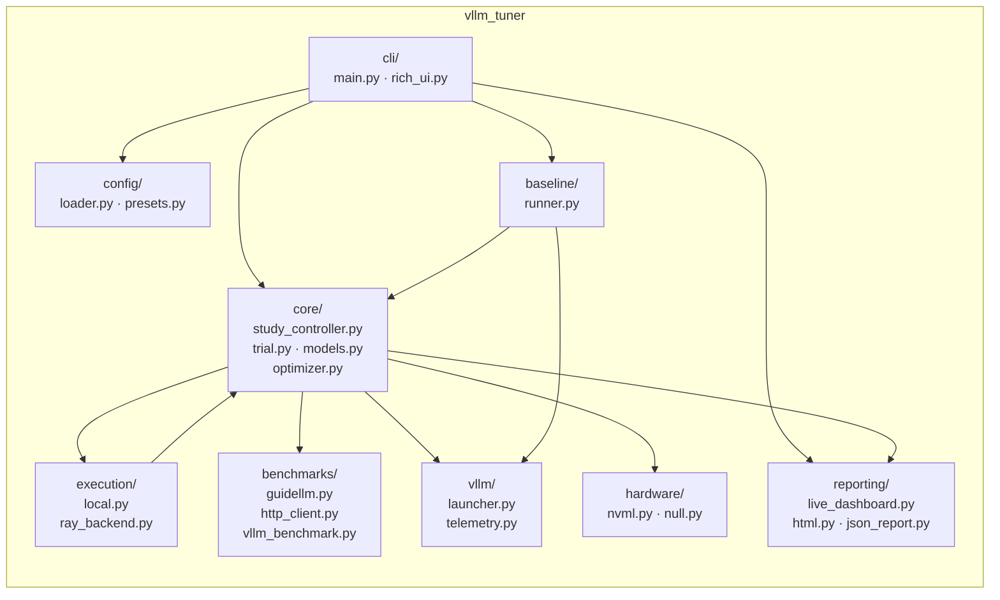

# vLLM Tuner

|            |                                                                                                                       |
| ---------- | --------------------------------------------------------------------------------------------------------------------- |
| CI/Testing | [](https://github.com/kryvokhyzha/vllm-tuner/actions/workflows/test.yml) [](https://codecov.io/gh/kryvokhyzha/vllm-tuner) |
| Package    | [](https://pypi.org/project/vllm-tuner/) [](https://pypi.org/project/vllm-tuner/) [](https://github.com/kryvokhyzha/vllm-tuner/blob/main/pyproject.toml)    |
| Meta       | [](https://github.com/astral-sh/ruff) [](https://github.com/kryvokhyzha/vllm-tuner/blob/main/LICENSE)

## 📖 About

Automated hyperparameter tuning for [vLLM](https://github.com/vllm-project/vllm) inference servers.
Uses [Optuna](https://optuna.org/) to search over vLLM serving parameters (e.g. `gpu_memory_utilization`,
`max_num_seqs`, `max_num_batched_tokens`) and finds configurations that maximize throughput, minimize
latency, or balance both — with optional cost analysis.

**Key features:**

- YAML config system with built-in presets (high throughput, low latency, balanced, cost-optimized)
- Supports GPU (NVIDIA) and TPU accelerators
- Local and Ray distributed execution backends
- Benchmark providers: [GuideLLM](https://github.com/neuralmagic/guidellm), HTTP (httpx), vLLM built-in
- HTML / JSON / YAML reports, Helm values export
- Kubernetes-ready with GPU and TPU job manifests

## 🏗️ Architecture

### High-Level Overview



### Trial Execution Flow

Each trial follows a 6-step lifecycle managed by `TrialRunner`:



### Optimization Loop



### Component Map



## 🚀 Quick Start

### Prerequisites

> [!IMPORTANT]
>
> - Python >= 3.11, < 3.14
> - `uv` package manager
>   ([installation guide](https://docs.astral.sh/uv/getting-started/installation/))
> - vLLM installed on the target machine
> - Hugging Face account with API token for gated model access

### Installation

```bash
# Install vLLM
uv pip install vllm

# Install vllm-tuner from PyPI
uv pip install vllm-tuner

# With all optional extras (GPU monitoring, GuideLLM, HTTP, Ray)
uv pip install "vllm-tuner[all]"
```

### Running a Tuning Study

#### Minimal — single model, default settings

```bash
python -m vllm_tuner.cli.main run --model "Qwen/Qwen2.5-0.5B-Instruct"
```

This runs 50 trials with the `high_throughput` preset on a local GPU using the GuideLLM benchmark provider.

#### With a config file

Use one of the bundled base configs, or create your own:

| Config                                 | Description                               |
| -------------------------------------- | ----------------------------------------- |
| `configs/high_throughput_gpu.yaml`     | Single GPU, maximize tokens/s             |
| `configs/low_latency_gpu.yaml`         | Single GPU, minimize p95 latency          |
| `configs/balanced_gpu.yaml`            | Single GPU, multi-objective (Pareto)      |
| `configs/high_throughput_tpu.yaml`     | TPU (GKE), maximize tokens/s              |
| `configs/multi_gpu.yaml`              | 4× GPU with tensor parallelism            |

```bash
python -m vllm_tuner.cli.main run --config configs/high_throughput_gpu.yaml

# Override model from CLI
python -m vllm_tuner.cli.main run --config configs/low_latency_gpu.yaml --model "Qwen/Qwen2.5-7B-Instruct"
```

#### Low-latency optimization

```bash
python -m vllm_tuner.cli.main run \
    --model "meta-llama/Llama-3-8B-Instruct" \
    --preset low_latency \
    --n_trials 30 \
    --output_dir ./results
```

### Available Presets

| Preset            | Objective                   | Description                        |
| ----------------- | --------------------------- | ---------------------------------- |
| `high_throughput` | maximize tokens/s           | Best for batch inference workloads |
| `low_latency`     | minimize p95 latency        | Best for real-time applications    |
| `balanced`        | multi-objective             | Trade-off between throughput & latency |
| `cost_optimized`  | maximize throughput per $   | Best for cost-sensitive deployments |

### CLI Commands

| Command     | Description                                            |
| ----------- | ------------------------------------------------------ |
| `run`       | Start a new tuning study                               |
| `resume`    | Resume an interrupted study                            |
| `report`    | Generate reports from a completed study                |
| `export`    | Export optimal config (YAML/JSON/Helm)                 |
| `list`      | List available presets, backends, or benchmark providers|
| `validate`  | Validate a configuration file                          |
| `recommend` | Recommend vLLM parameters for a model                  |

```bash
# Resume an interrupted study
python -m vllm_tuner.cli.main resume --study_name my-study --storage sqlite:///study.db

# Generate an HTML report from a completed study
python -m vllm_tuner.cli.main report --study_name my-study --output_dir ./results

# Export the best config as YAML (also supports --helm for Helm values)
python -m vllm_tuner.cli.main export --study_name my-study --format yaml --output best.yaml

# Recommend vLLM parameters based on model and hardware
python -m vllm_tuner.cli.main recommend --model "meta-llama/Llama-3-8B-Instruct" --vram 24 --num_gpus 1

# List available presets, backends, or benchmark providers
python -m vllm_tuner.cli.main list --what presets

# Validate a config file
python -m vllm_tuner.cli.main validate --config my_study.yaml
```

<!-- ### Running on Kubernetes

Job manifests are in `scripts/k8s/`, using public Docker Hub images:

```bash
# GPU job
kubectl apply -f scripts/k8s/tuning-job-gpu.yaml

# TPU job
kubectl apply -f scripts/k8s/tuning-job-tpu.yaml
```

Edit the `ConfigMap` inside each manifest to change the model, trial count, or parameters.
Results are written to `/results` inside the pod:

```bash
kubectl cp $(kubectl get pods -l job-name=vllm-tuner-gpu \
  -o jsonpath='{.items[0].metadata.name}'):/results ./results
``` -->

## ⚙️ Development Environment Setup

> [!WARNING]
> This project is based on `Python 3.13` and uses `uv` for dependency management.

1. Clone the repository:

   ```bash
   git clone <repository-url>
   cd <your-repo-name>
   ```

1. Install `uv` following the
   [official documentation](https://docs.astral.sh/uv/getting-started/installation/).

1. Create a virtual environment:

   ```bash
   uv venv --python 3.13
   ```

1. Activate the environment:

   ```bash
   source .venv/bin/activate
   ```

1. Install dependencies:

   ```bash
   uv sync --all-extras --no-install-project
   ```

1. Setup pre-commit hooks:

   ```bash
   pre-commit install
   ```

## 📝 Contributing

1. Fork repository and create a feature branch.
1. Follow existing code style (enforced by pre-commit hooks).
1. Add tests for new functionality.
1. Submit a PR for review.

## 📖 Useful Resources

- [vLLM Performance Tuning: The Ultimate Guide to xPU Inference Configuration](https://cloud.google.com/blog/topics/developers-practitioners/vllm-performance-tuning-the-ultimate-guide-to-xpu-inference-configuration)
- [auto-tuning-vllm](https://github.com/openshift-psap/auto-tuning-vllm)
- [vllm-tuner](https://github.com/jranaraki/vllm-tuner)
- [TPU Inference Recipes](https://github.com/AI-Hypercomputer/tpu-recipes/tree/main/inference)
